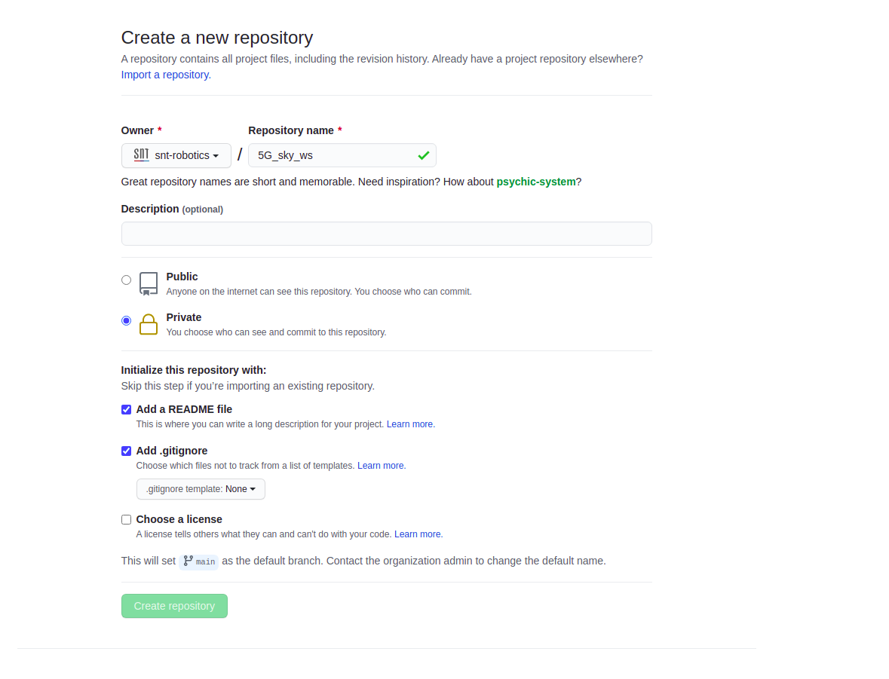

# ARG Software Architecture 

This repository is provides a brief guide on of the software architecture to be followed during the execution of the projects of the Automation and Robotics Research Group (ARG). If all of us follow this architecture we can have a standardized rules for developing, managing and executing workspaces and most of the developed code can be reutilized between different projects.

## How Do I Start?

* ### Create Github Account

    Firstly, if you dont have a github account create one and also setup the ssh keys for your computer and add them to your github account. SSH keys are useful for faster and secure pulling and pushing of your code. See [this guide](https://www.inmotionhosting.com/support/server/ssh/how-to-add-ssh-keys-to-your-github-account/) for setting up your ssh keys.

* ### Repository Management

    Each project will have a parent repo named as *project_ws*. For example in case of the project stugalux, the parent repo is called as *stugalux_ws*. We will use ros [vcs-tools](http://wiki.ros.org/vcstool) for repository management. The instructions below are used for creating a parent repository for the project *5G_sky* which will be named a [5G_sky_ws](https://github.com/snt-robotics/5G_sky_ws). 

* #### Create a new repo on github as shown in the image below:
    
     

* ####   Clone the repo locally in your workspace folder:   
    ``` 
    mkdir -p ~/workspace/ros/ && cd ~/workspace/ros/
    git clone git@github.com:snt-robotics/5G_sky_ws.git
    cd 5G_sky_ws/ && curl -O  https://raw.githubusercontent.com/hridaybavle/.gitignore/master/.gitignore
    git add .gitignore && git commit -m 'added .gitignore' && git push
    ```

* #### Create the folder structure:

    ```
    cd ~/workspace/ros/5G_sky_ws && mkdir src && cd src
    mkdir -p drivers/real &&  mkdir -p drivers/simulation
    mkdir generic && mkdir navigation && mkdir utils
    ```

    In the above commands we created a folder structure for our algorithm repos inside src folder. There will be four main folders namely: **drivers**, **generic**, **navigation**, **utils**. Note: More folders can be added based on the requirements of each projects, but try to keep the folder structure as compact as possible.

    * **drivers** : This folder would contain all the necessary packages for which provide necessary drivers for running the simulation environments as well as the real robot along with its on-board sensors. For example drivers can have sub-folders such as *real* and *simulation* which contain the packages for executing the real world robot and the robot in simulation respectively. 

    * **generic** : This folder contains all the relevant packages for launching all the processes required for successully executing a relevant task/mission for the project. It can be sub-divided into bringup and desciption packages. Example `5G_sky_ws` will have `5G_sky_bringup` and `5G_sky_description`. In the section below we will explain in detail the creation of these repositories. 

    * **navigation** : This folder would contain all the packages required for navigation of the robot. It can be divided into sub-folders such as `slam`, `localization`, `planning` and `perception`. 

    * **utils** : This folder should contain all the additional packages required but are not available in the form of binaries.

* #### Create the Project Bringup and Project Description:

    Each project will have a bringup repository and a description repository, these repos will be named as project_bringup and project_description.

    * **project_bringup** : The project_bringup as the name suggests is responsible for bringing up all the processes responsible for proper execution of the robot and its sensors, where it be in a simulated environment or in real world. Basically it has all the launch and config files of the different packages which are grouped together to launch an entire mission of the robot. How to create a bringup repo (example: `5G_sky_bringup`):
        
        ```
        cd ~/workspace/ros/5G_sky_ws/src/generic && catkin_create_pkg 5G_sky_bringup roscpp rospy 
        cd 5G_sky_bringup && mkdir launch && mkdir config
        ```    

        The above command creates a ros repo, it also adds `launch` and `config` folders. You have to push this created ros repo to github. 

    * **project_description** : As the name suggests the project description contains the description files the projects. The description file contains the urdfs, meshes, worlds etc for the robots and the environment of the robot. 
        
        ```
        cd ~/workspace/ros/5G_sky_ws/src/generic && catkin_create_pkg 5G_sky_description
        cd 5G_sky_description && mkdir launch && mkdir config && mkdir urdf && mkdir worlds
        ```    

        The above command will create a ros repo which will have `launch`, `config`, `urdf` and `worlds` folders. 


* #### Clone all Remaining Required Repos: 

    You should also clone all the relevant ros packages that do not have binaries and need to installed in the project_ws in the relevant folders. For example if we need a ros package of `hdl_graph_slam` inside our `5G_sky_ws` you can clone it inside the folder navigation/SLAM

* #### Upload the Workspace Management File:

    Once you have all the repos cloned just perform the command below to create a `.rosinstall` file which will contain the entire repository management. 

    ```
    cd ~/workspace/ros/5G_sky_ws && touch .rosinstall
    vcs export src > .rosinstall
    git add .rosinstall && git commit -m 'added .rosinstall'
    git push 
    ```

* #### Maintain the Workspace
    
    *  Push the Repos in the workspace

    * Tag the Repos in the workspace

    * Update the Repos in the workspace

