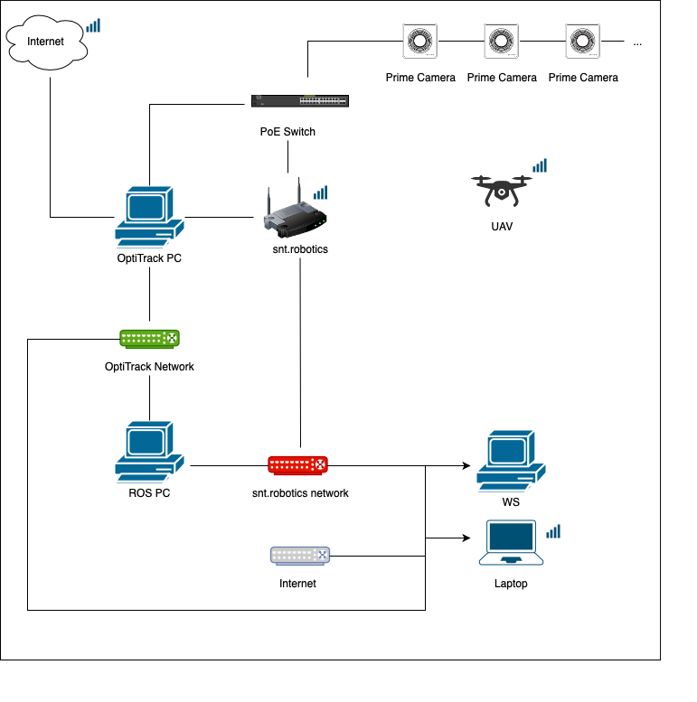

# AeroLab Networks
This section contains the used networks and passwords in the AeroLab.

## Robonet
This netwok is for the internet connection.
**Password**: Procrob@2016

## OptiTrack
This network is for the OptiTrack data
**Password**: 

## robotics.snt.uni.lu - Ethernet3
This network is a local network for the robots communication
**Password**: control4uav

## Connections diagram

